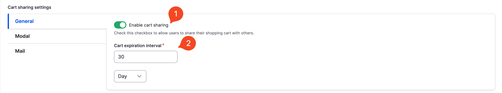
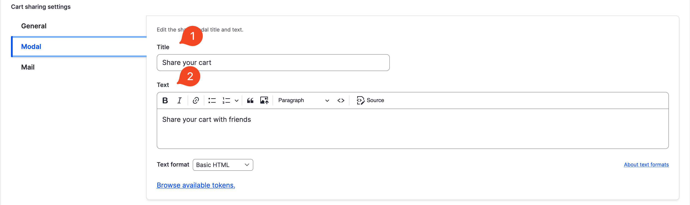
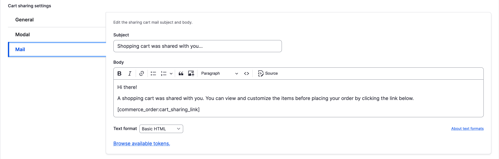
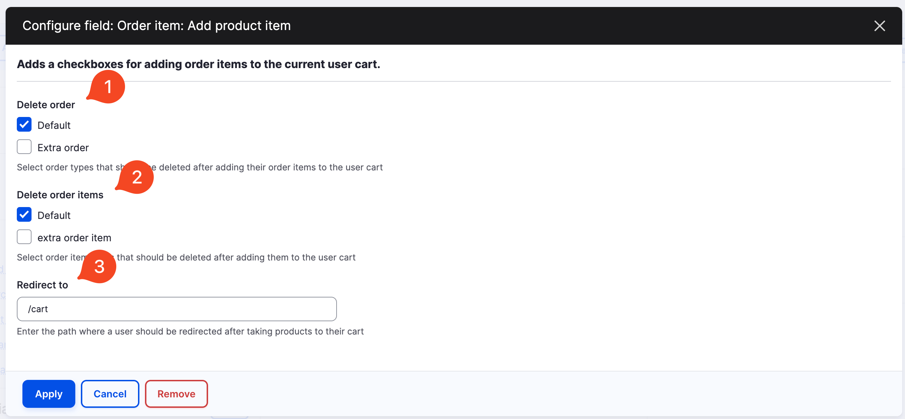

## INTRODUCTION

The **Commerce Share Cart** module for Drupal allows customers to share their shopping carts with others by sending unique links via email.

## Key Features:
- **Permission Settings**: Administrators can configure who can share a cart.
- **Cart Sharing via email**: Users can share a cart via mail and recipients can view the cart contents and take products to their carts.
- **Fully configurable sharing**: Administrators can enable sharing functionalities for specific order types and configure texts for modal and mail. Also, they can configure the interval when a shared cart is available.


## REQUIREMENTS

- **Drupal 11**
- **PHP 8.3**
- [Commerce](https://www.drupal.org/project/commerce)
- [Drupal Symfony Mailer](https://www.drupal.org/project/symfony_mailer) (optional)

## INSTALLATION

1. Add a new repository to your `composer.json` file
  ```json
  {
    "type": "vcs",
    "url": "git@github.com:Chizh273/commerce_share_cart.git"
  }
  ```
2. Run `composer req drupal/commerce_share_cart`
3. Enable this module via drush or admin panel
4. Go to your order type for which you'd like to enable cart sharing and enable it.

## CONFIGURATION

1. **Order type** General settings:

<figure>
  
  <figcaption style="text-align: center;"><b>Image 1:</b> General settings</figcaption>
</figure>

| Ref  | Name                     | Usage                                                                                                                                                 |
|------|--------------------------|-------------------------------------------------------------------------------------------------------------------------------------------------------|
| 1.1. | Enable                   | This checkbox determines whether cart sharing functionality should appear on the cart of this order type.                                             |
| 1.2. | Cart expiration interval | This section contains two fields: one for numbers and another for time units. These fields set the duration after which shared carts will be deleted. |


2. **Order type** Modal settings:

<figure>
  
  <figcaption style="text-align: center;"><b>Image 2:</b> Modal settings</figcaption>
</figure>

| Ref  | Name    | Usage                                                                                                                             |
|------|---------|-----------------------------------------------------------------------------------------------------------------------------------|
| 2.1. | Subject | This text field is used for setting the title of the sharing modal. This field supports order and global tokens.                  |
| 2.2. | Body    | This formatted text field is used for setting the text content in the sharing modal. This field supports order and global tokens. |


3. **Order type** Mail settings:

<figure>
  
  <figcaption style="text-align: center;"><b>Image 3:</b> Mail settings</figcaption>
</figure>

| Ref  | Name    | Usage                                                                                                                             |
|------|---------|-----------------------------------------------------------------------------------------------------------------------------------|
| 3.1. | Subject | This text field is used for setting the title of the sharing modal. This field supports order and global tokens.                  |
| 3.2. | Body    | This formatted text field is used for setting the text content in the sharing modal. This field supports order and global tokens. |


4. Add product view field:

<figure>
  
  <figcaption style="text-align: center;"><b>Image 4:</b> Add product view field</figcaption>
</figure>

| Ref  | Name               | Usage                                                                                                                                                        |
|------|--------------------|--------------------------------------------------------------------------------------------------------------------------------------------------------------|
| 4.1. | Delete order       | These checkboxes are used to determine by type whether orders will be deleted after adding their order items to a user cart.                                 |
| 4.2. | Delete order items | These checkboxes are used to determine by type whether order items will be deleted after adding them to a user cart.                                         |
| 4.3. | Redirect to        | This text field is used for setting the redirect destination where the user will be redirected after using the "Add products" button on the share cart page. |
